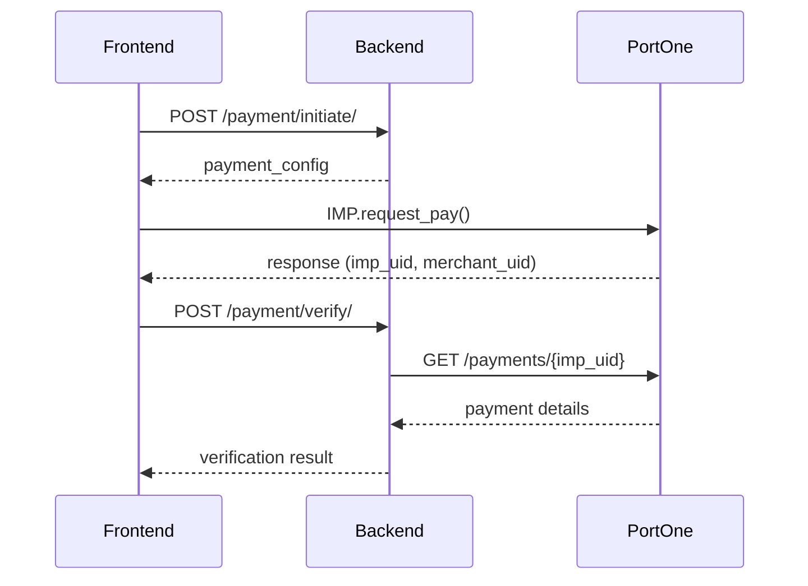
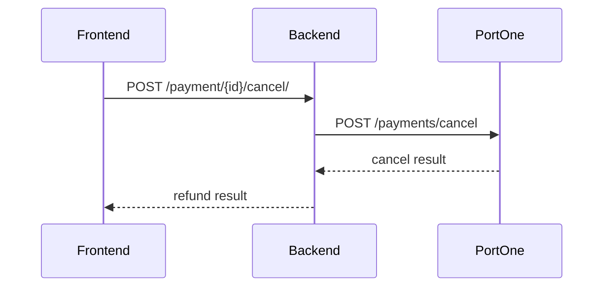

# King Bus Reservation System - API 명세서

> Backend: reservation-system (Django REST Framework)
>
> Last Updated: 2025-11-13

## 목차

1. [개요](#개요)
2. [인증 방식](#인증-방식)
3. [고객 API](#고객-api)
4. [관리자 API](#관리자-api)
5. [데이터 모델](#데이터-모델)
6. [예약 상태 흐름](#예약-상태-흐름)
7. [견적 계산 로직](#견적-계산-로직)
8. [에러 처리](#에러-처리)

---

## 개요

King Bus 예약 시스템은 관광버스 예약을 위한 RESTful API를 제공합니다.

### Base URLs

| 구분 | Base URL | 설명 |
|------|----------|------|
| 고객 API | `/api/v1/reservation/` | 일반 사용자용 예약 API |
| 관리자 API | `/reservation/api/admin/` | TRP 시스템 연동 관리자 API |

### 주요 기능

- 실시간 견적 계산 (거리, 시즌, 차량 타입 기반)
- 예약 생성 및 관리
- PortOne 결제 연동 (이니시스)
- Twilio SMS 인증
- TRP 시스템 배차 연동
- 요금 정책 관리
- 통계 및 분석

---

## 인증 방식

### 1. 고객 API 인증 (Supabase JWT)

```http
Authorization: Bearer <supabase_jwt_token>
```

**인증 흐름:**
1. 사용자가 Supabase를 통해 로그인 (Google, Email 등)
2. Supabase에서 JWT 토큰 발급
3. 모든 API 요청에 토큰 포함
4. 백엔드에서 Supabase JWT 검증

**토큰 구조:**
```json
{
  "sub": "user-uuid",
  "email": "user@example.com",
  "user_metadata": {
    "name": "홍길동"
  }
}
```

### 2. 관리자 API 인증 (TRP Token)

```http
Authorization: Bearer <RPA_P_API_TOKEN>
X-User-ID: <trp_member_id>
```

**인증 흐름:**
1. TRP 시스템에서 API 토큰 발급
2. 각 요청에 토큰과 사용자 ID 포함
3. 백엔드에서 TRP Member Service를 통해 검증

---

## 고객 API

Base URL: `/api/v1/reservation/`

### 예약 관리

#### 1. 예약 목록 조회

**GET** `/api/v1/reservation/`

예약 목록을 페이지네이션으로 조회합니다.

**인증:** 필수 (Supabase JWT)

**Query Parameters:**

| 파라미터 | 타입 | 필수 | 설명 |
|---------|------|------|------|
| status | string | X | 상태별 필터 (pending, payment_waiting, confirmed 등) |
| page | integer | X | 페이지 번호 (기본값: 1) |

**Response (200 OK):**

```json
{
  "count": 10,
  "next": "http://api.example.com/api/v1/reservation/?page=2",
  "previous": null,
  "results": [
    {
      "id": 1,
      "departure_location": "서울역",
      "destination_location": "부산",
      "departure_date": "2025-12-01T09:00:00Z",
      "return_date": null,
      "passenger_count": 35,
      "vehicle_count": 1,
      "vehicle_type": "general",
      "vehicle_type_display": "일반형 (28-45인승)",
      "is_multi_vehicle": false,
      "passengers_per_vehicle": 35,
      "is_round_trip": false,
      "status": "payment_waiting",
      "status_display": "결제 대기",
      "quote_amount": "850000",
      "deposit_amount": 85000,
      "remaining_amount": 765000,
      "created_at": "2025-11-13T10:00:00Z"
    }
  ]
}
```

---

#### 2. 예약 생성

**POST** `/api/v1/reservation/`

새로운 버스 예약을 생성합니다.

**인증:** 필수 (Supabase JWT)

**Request Body:**

```json
{
  "departure_location": "서울역",
  "departure_coordinates": "37.5547,126.9707",
  "destination_location": "부산",
  "destination_coordinates": "35.1796,129.0756",
  "departure_date": "2025-12-01T09:00:00Z",
  "return_date": null,
  "passenger_count": 35,
  "vehicle_count": 1,
  "vehicle_type": "general",
  "is_round_trip": false,
  "driver_accompanied": true,
  "special_requirements": "주차 공간 필요"
}
```

**필드 설명:**

| 필드 | 타입 | 필수 | 제약사항 | 설명 |
|------|------|------|----------|------|
| departure_location | string | O | - | 출발지명 |
| departure_coordinates | string | O | "lat,lng" | 출발지 좌표 |
| destination_location | string | O | - | 도착지명 |
| destination_coordinates | string | O | "lat,lng" | 도착지 좌표 |
| departure_date | datetime | O | ISO 8601 | 출발 일시 |
| return_date | datetime | X | ISO 8601 | 복귀 일시 (왕복일 경우) |
| passenger_count | integer | O | 1-500 | 승객 수 |
| vehicle_count | integer | X | 1-20 | 차량 수 (자동 계산 가능) |
| vehicle_type | string | O | general/solati | 차량 타입 |
| is_round_trip | boolean | O | - | 왕복 여부 |
| driver_accompanied | boolean | X | 기본값: true | 기사 동승 여부 |
| special_requirements | string | X | - | 특이사항 |

**Validation:**
- `passenger_count`: 1명 이상 500명 이하
- `vehicle_count`: 1대 이상 20대 이하
- 차량 수용 가능 인원: 일반형 45명/대, 쏠라티 15명/대
- 최소 차량 수: `ceiling(passenger_count / max_capacity)`

**Response (201 Created):**

```json
{
  "id": 1,
  "customer": {
    "id": "uuid",
    "email": "user@example.com",
    "name": "홍길동",
    "phone": "010-1234-5678"
  },
  "departure_location": "서울역",
  "departure_coordinates": "37.5547,126.9707",
  "destination_location": "부산",
  "destination_coordinates": "35.1796,129.0756",
  "departure_date": "2025-12-01T09:00:00Z",
  "return_date": null,
  "passenger_count": 35,
  "vehicle_count": 1,
  "vehicle_type": "general",
  "vehicle_type_display": "일반형 (28-45인승)",
  "is_multi_vehicle": false,
  "is_round_trip": false,
  "driver_accompanied": true,
  "status": "pending",
  "status_display": "예약 대기",
  "quote_amount": "850000",
  "deposit_amount": 85000,
  "remaining_amount": 765000,
  "special_requirements": "주차 공간 필요",
  "created_at": "2025-11-13T10:00:00Z",
  "updated_at": "2025-11-13T10:00:00Z"
}
```

**Error Response (400 Bad Request):**

```json
{
  "error": "승객 수가 차량 수용 인원을 초과합니다."
}
```

---

#### 3. 예약 상세 조회

**GET** `/api/v1/reservation/{id}/`

특정 예약의 상세 정보를 조회합니다.

**인증:** 필수 (Supabase JWT)

**Path Parameters:**

| 파라미터 | 타입 | 설명 |
|---------|------|------|
| id | integer | 예약 ID |

**Response (200 OK):**

```json
{
  "id": 1,
  "customer": {
    "id": "uuid",
    "email": "user@example.com",
    "name": "홍길동",
    "phone": "010-1234-5678"
  },
  "departure_location": "서울역",
  "destination_location": "부산",
  "departure_date": "2025-12-01T09:00:00Z",
  "return_date": null,
  "passenger_count": 35,
  "vehicle_count": 1,
  "vehicle_type": "general",
  "status": "confirmed",
  "status_display": "예약 확정",
  "quote_amount": "850000",
  "deposit_amount": 85000,
  "remaining_amount": 765000,
  "quote": {
    "id": 1,
    "total_price": "850000",
    "distance_km": 325.5,
    "estimated_hours": 4.5,
    "calculation_details": {
      "base_price": 750000,
      "fuel_cost": 50000,
      "toll_fee": 30000,
      "driver_multiplier": 1.15,
      "season": "비성수기"
    }
  },
  "payments": [
    {
      "id": "uuid",
      "amount": 85000,
      "status": "paid",
      "payment_method": "card",
      "paid_at": "2025-11-13T11:00:00Z"
    }
  ],
  "created_at": "2025-11-13T10:00:00Z"
}
```

---

#### 4. 예약 수정

**PATCH** `/api/v1/reservation/{id}/`

예약 정보를 수정합니다.

**인증:** 필수 (Supabase JWT)

**제약사항:**
- 상태가 `pending` 또는 `payment_waiting`일 때만 수정 가능
- 일부 필드는 수정 불가능할 수 있음

**Request Body:**

```json
{
  "passenger_count": 40,
  "special_requirements": "주차 공간 및 식사 장소 추천 부탁"
}
```

**Response (200 OK):**

수정된 예약 객체 반환

---

#### 5. 예약 취소

**POST** `/api/v1/reservation/{id}/cancel/`

예약을 취소합니다.

**인증:** 필수 (Supabase JWT)

**취소 조건:**
- 예약 상태가 `dispatched`, `in_progress`, `completed`, `cancelled`가 아니어야 함
- 출발일 3일 전까지만 취소 가능

**Response (200 OK):**

```json
{
  "message": "예약이 취소되었습니다."
}
```

**Error Response (400 Bad Request):**

```json
{
  "error": "출발일 3일 전까지만 취소 가능합니다."
}
```

---

### 견적 계산

#### 6. 실시간 견적 조회

**GET** `/api/v1/reservation/quote/`

예약 전 실시간으로 견적을 계산합니다.

**인증:** 필수 (Supabase JWT)

**Query Parameters:**

| 파라미터 | 타입 | 필수 | 설명 |
|---------|------|------|------|
| departure_location | string | O | 출발지명 |
| destination_location | string | O | 도착지명 |
| departure_coordinates | string | O | 출발지 좌표 "lat,lng" |
| destination_coordinates | string | O | 도착지 좌표 "lat,lng" |
| passenger_count | integer | O | 승객 수 (1-500) |
| departure_date | string | O | 출발일 (ISO 8601) |
| return_date | string | X | 복귀일 (ISO 8601) |
| is_round_trip | boolean | O | 왕복 여부 |
| is_solati | boolean | O | 쏠라티 여부 |
| vehicle_count | integer | X | 차량 수 (1-20) |

**Example Request:**

```
GET /api/v1/reservation/quote/?departure_location=서울역&destination_location=부산&departure_coordinates=37.5547,126.9707&destination_coordinates=35.1796,129.0756&passenger_count=35&departure_date=2025-12-01T09:00:00Z&is_round_trip=false&is_solati=false
```

**Response (200 OK):**

```json
{
  "success": true,
  "total_price": 850000,
  "deposit_amount": 85000,
  "remaining_amount": 765000,
  "distance_km": 325.5,
  "estimated_hours": 4.5,
  "days": 1,
  "vehicle_count": 1,
  "is_multi_vehicle": false,
  "vehicle_breakdown": [
    {
      "vehicle_no": 1,
      "passengers": 35
    }
  ],
  "vehicle_type_display": "일반형",
  "season_display": "비성수기",
  "is_round_trip": false,
  "summary": {
    "base_info": "325.5km, 1일",
    "vehicle_season": "일반형, 비성수기",
    "pricing_note": "1일 기준: 850,000원"
  }
}
```

**복수 차량 예시 (90명):**

```json
{
  "success": true,
  "total_price": 1700000,
  "deposit_amount": 170000,
  "remaining_amount": 1530000,
  "vehicle_count": 2,
  "is_multi_vehicle": true,
  "vehicle_breakdown": [
    {
      "vehicle_no": 1,
      "passengers": 45
    },
    {
      "vehicle_no": 2,
      "passengers": 45
    }
  ]
}
```

---

### 고객 프로필

#### 7. 프로필 조회

**GET** `/api/v1/reservation/profile/`

현재 로그인한 고객의 프로필을 조회합니다.

**인증:** 필수 (Supabase JWT)

**Response (200 OK):**

```json
{
  "id": "uuid",
  "email": "user@example.com",
  "name": "홍길동",
  "phone": "010-1234-5678",
  "provider": "google",
  "created_at": "2025-01-01T00:00:00Z",
  "updated_at": "2025-11-13T10:00:00Z",
  "last_login_at": "2025-11-13T09:00:00Z"
}
```

---

#### 8. 프로필 수정

**PATCH** `/api/v1/reservation/profile/`

고객 프로필을 수정합니다.

**인증:** 필수 (Supabase JWT)

**Request Body:**

```json
{
  "name": "홍길동",
  "phone": "010-1234-5678"
}
```

**Response (200 OK):**

수정된 프로필 반환

---

### 결제

#### 9. 결제 시작

**POST** `/api/v1/reservation/{reservation_id}/payment/initiate/`

PortOne 결제 프로세스를 시작합니다.

**인증:** 필수 (Supabase JWT)

**Path Parameters:**

| 파라미터 | 타입 | 설명 |
|---------|------|------|
| reservation_id | integer | 예약 ID |

**Response (200 OK):**

```json
{
  "success": true,
  "payment_config": {
    "pg": "html5_inicis",
    "pay_method": "card",
    "merchant_uid": "MERCHANT_202511131234567890",
    "name": "킹버스 예약금",
    "amount": 85000,
    "buyer_email": "user@example.com",
    "buyer_name": "홍길동",
    "buyer_tel": "010-1234-5678"
  },
  "deposit_amount": 85000,
  "total_amount": 850000,
  "remaining_amount": 765000
}
```

**프론트엔드 사용 예시:**

```javascript
// PortOne SDK 초기화 후
IMP.request_pay({
  ...payment_config,
  // PortOne 응답 콜백
}, function(response) {
  if (response.success) {
    // 결제 성공 시 verify API 호출
    verifyPayment(response.imp_uid, response.merchant_uid);
  } else {
    // 결제 실패
    alert('결제 실패: ' + response.error_msg);
  }
});
```

---

#### 10. 결제 검증

**POST** `/api/v1/reservation/payment/verify/`

PortOne 결제 완료 후 검증합니다.

**인증:** 필수 (Supabase JWT)

**Request Body:**

```json
{
  "imp_uid": "imp_1234567890",
  "merchant_uid": "MERCHANT_202511131234567890"
}
```

**필드 설명:**

| 필드 | 타입 | 필수 | 설명 |
|------|------|------|------|
| imp_uid | string | O | PortOne 결제 고유번호 |
| merchant_uid | string | O | 가맹점 주문번호 |

**Response (200 OK):**

```json
{
  "success": true,
  "message": "결제가 완료되었습니다.",
  "payment_status": "결제 완료",
  "reservation_status": "예약 확정",
  "receipt_url": "https://portone.io/receipt/imp_1234567890"
}
```

**Error Response (400 Bad Request):**

```json
{
  "error": "결제 금액이 일치하지 않습니다."
}
```

---

#### 11. 결제 상태 조회

**GET** `/api/v1/reservation/{reservation_id}/payment/status/`

예약의 결제 상태를 조회합니다.

**인증:** 필수 (Supabase JWT)

**Response (200 OK):**

```json
{
  "reservation_status": "payment_completed",
  "reservation_status_display": "결제 완료",
  "has_payment": true,
  "deposit_amount": 85000,
  "remaining_amount": 765000,
  "total_amount": 850000,
  "payment": {
    "id": "uuid",
    "status": "paid",
    "status_display": "결제 완료",
    "amount": 85000,
    "paid_at": "2025-11-13T12:00:00Z",
    "receipt_url": "https://portone.io/receipt/imp_123",
    "payment_method": "card",
    "can_cancel": true
  }
}
```

---

#### 12. 결제 취소 (환불)

**POST** `/api/v1/reservation/payment/{payment_id}/cancel/`

결제를 취소하고 환불 처리합니다.

**인증:** 필수 (Supabase JWT)

**Path Parameters:**

| 파라미터 | 타입 | 설명 |
|---------|------|------|
| payment_id | string | 결제 ID (UUID) |

**Request Body:**

```json
{
  "reason": "고객 변심"
}
```

**Response (200 OK):**

```json
{
  "success": true,
  "message": "환불이 완료되었습니다.",
  "refund_amount": 85000
}
```

---

#### 13. 결제 내역 조회

**GET** `/api/v1/reservation/payment/history/`

고객의 전체 결제 내역을 조회합니다.

**인증:** 필수 (Supabase JWT)

**Query Parameters:**

| 파라미터 | 타입 | 필수 | 설명 |
|---------|------|------|------|
| page | integer | X | 페이지 번호 |

**Response (200 OK):**

```json
{
  "count": 5,
  "next": null,
  "previous": null,
  "results": [
    {
      "id": "uuid",
      "reservation_id": 1,
      "amount": 85000,
      "status": "paid",
      "payment_method": "card",
      "paid_at": "2025-11-13T12:00:00Z",
      "receipt_url": "https://..."
    }
  ]
}
```

---

#### 14. 결제 콜백 (Webhook)

**POST** `/api/v1/reservation/payment/callback/`

PortOne에서 발생하는 결제 이벤트를 수신합니다.

**인증:** 없음 (PortOne webhook)

**CSRF:** Exempt

**Request Body:** PortOne webhook payload

**용도:** 결제 완료, 실패, 취소 등의 이벤트 실시간 처리

---

### 휴대폰 인증

#### 15. 인증 코드 발송

**POST** `/api/v1/reservation/verification/send/`

SMS 인증 코드를 발송합니다.

**인증:** 필수 (Supabase JWT)

**Request Body:**

```json
{
  "phone": "010-1234-5678"
}
```

**Response (200 OK):**

```json
{
  "success": true,
  "message": "인증 코드가 전송되었습니다.",
  "expires_in": 300
}
```

**개발 환경 Response:**

```json
{
  "success": true,
  "message": "인증 코드가 전송되었습니다.",
  "expires_in": 300,
  "code": "123456"
}
```

**제약사항:**
- 5분간 유효
- 하루 최대 5회 발송 가능

---

#### 16. 인증 코드 검증

**POST** `/api/v1/reservation/verification/verify/`

SMS 인증 코드를 검증합니다.

**인증:** 필수 (Supabase JWT)

**Request Body:**

```json
{
  "phone": "010-1234-5678",
  "code": "123456"
}
```

**Response (200 OK):**

```json
{
  "success": true,
  "message": "인증이 완료되었습니다."
}
```

**Side Effect:** 고객의 휴대폰 번호가 자동으로 업데이트됩니다.

**Error Response (400 Bad Request):**

```json
{
  "error": "인증 코드가 일치하지 않습니다."
}
```

---

## 관리자 API

Base URL: `/reservation/api/admin/`

### 예약 관리

#### 17. 전체 예약 목록 조회

**GET** `/reservation/api/admin/reservations/`

모든 예약을 조회합니다 (관리자용).

**인증:** 필수 (TRP Token)

**Query Parameters:**

| 파라미터 | 타입 | 필수 | 설명 |
|---------|------|------|------|
| search | string | X | 고객명, 위치, 예약ID 검색 |
| status | string | X | 상태 필터 |
| date_from | date | X | 시작일 필터 (YYYY-MM-DD) |
| date_to | date | X | 종료일 필터 (YYYY-MM-DD) |
| dispatch_id | integer | X | TRP 배차 ID 필터 |
| multi_vehicle | boolean | X | 복수 차량 필터 |
| page | integer | X | 페이지 번호 |

**Response (200 OK):**

```json
{
  "count": 150,
  "next": "...",
  "previous": null,
  "results": [
    {
      "id": 1,
      "customer": {
        "email": "user@example.com",
        "name": "홍길동",
        "phone": "010-1234-5678"
      },
      "departure_location": "서울역",
      "destination_location": "부산",
      "departure_date": "2025-12-01T09:00:00Z",
      "passenger_count": 35,
      "vehicle_count": 1,
      "status": "confirmed",
      "quote_amount": "850000",
      "trp_dispatch_id": 456,
      "assigned_vehicle_id": 789,
      "assigned_driver_id": 101,
      "approved_by": {
        "id": 1,
        "name": "관리자"
      },
      "approved_at": "2025-11-13T11:00:00Z",
      "created_at": "2025-11-13T10:00:00Z"
    }
  ]
}
```

---

#### 18. 예약 생성 (관리자)

**POST** `/reservation/api/admin/reservations/`

관리자가 직접 예약을 생성합니다.

**인증:** 필수 (TRP Token, staff/superuser)

**Request Body:**

```json
{
  "customer_email": "customer@example.com",
  "customer_name": "김철수",
  "customer_phone": "010-9876-5432",
  "departure_location": "서울역",
  "departure_coordinates": "37.5547,126.9707",
  "destination_location": "부산",
  "destination_coordinates": "35.1796,129.0756",
  "departure_date": "2025-12-01T09:00:00Z",
  "return_date": null,
  "passenger_count": 35,
  "vehicle_count": 1,
  "vehicle_type": "general",
  "is_round_trip": false,
  "driver_accompanied": true,
  "custom_quote_amount": 900000,
  "special_requirements": "VIP 고객"
}
```

**추가 필드:**
- `custom_quote_amount`: 관리자가 직접 견적 금액 설정 가능

**Response (201 Created):**

```json
{
  "message": "예약이 생성되었습니다.",
  "reservation_id": 123,
  "vehicle_info": {
    "vehicle_count": 1,
    "vehicle_type": "general",
    "is_multi_vehicle": false,
    "breakdown": [
      {"vehicle_no": 1, "passengers": 35}
    ]
  },
  "status": "success"
}
```

---

#### 19. 예약 상세 조회 (관리자)

**GET** `/reservation/api/admin/reservations/{id}/`

예약 상세 정보를 조회합니다 (관리자용).

**인증:** 필수 (TRP Token)

**Response (200 OK):**

고객 API보다 더 많은 정보 포함:
- 배차 정보 (TRP dispatch ID, vehicle ID, driver ID)
- 승인자 정보
- 상태 변경 히스토리
- 전체 결제 내역

---

#### 20. 예약 수정 (관리자)

**PUT/PATCH** `/reservation/api/admin/reservations/{id}/`

예약을 수정합니다.

**인증:** 필수 (TRP Token)

**Request Body:** 수정할 필드들

---

#### 21. 예약 삭제

**DELETE** `/reservation/api/admin/reservations/{id}/`

예약을 삭제합니다.

**인증:** 필수 (TRP Token)

**Response (204 No Content)**

---

### 예약 상태 관리

#### 22. 예약 승인

**POST** `/reservation/api/admin/reservations/{id}/approve/`

대기중인 예약을 승인합니다.

**인증:** 필수 (TRP Token)

**조건:** 상태가 `pending`이어야 함

**Response (200 OK):**

```json
{
  "message": "예약이 승인되었습니다."
}
```

**Side Effects:**
- 상태가 `payment_waiting`으로 변경
- `approved_by`, `approved_at` 설정
- 고객에게 알림 발송

---

#### 23. 예약 거부

**POST** `/reservation/api/admin/reservations/{id}/reject/`

예약을 거부/취소합니다.

**인증:** 필수 (TRP Token)

**Request Body:**

```json
{
  "reason": "차량 부족으로 인한 취소"
}
```

**Response (200 OK):**

```json
{
  "message": "예약이 취소되었습니다."
}
```

---

#### 24. 예약 확정

**POST** `/reservation/api/admin/reservations/{id}/confirm/`

결제 완료된 예약을 확정합니다.

**인증:** 필수 (TRP Token)

**조건:** 상태가 `payment_completed`이어야 함

**Response (200 OK):**

```json
{
  "message": "예약이 확정되었습니다."
}
```

**Side Effects:**
- 상태가 `confirmed`로 변경
- TRP 시스템에 배차 요청 알림 발송

---

#### 25. 운행 시작

**POST** `/reservation/api/admin/reservations/{id}/start_operation/`

운행을 시작합니다.

**인증:** 필수 (TRP Token)

**조건:** 상태가 `dispatched`이어야 함

**Response (200 OK):**

```json
{
  "message": "운행이 시작되었습니다."
}
```

---

#### 26. 운행 완료

**POST** `/reservation/api/admin/reservations/{id}/complete_operation/`

운행을 완료 처리합니다.

**인증:** 필수 (TRP Token)

**조건:** 상태가 `in_progress`이어야 함

**Response (200 OK):**

```json
{
  "message": "운행이 완료되었습니다."
}
```

---

### 견적 관리

#### 27. 견적 수정

**POST** `/reservation/api/admin/reservations/{id}/update_quote/`

견적 금액을 수동으로 수정합니다.

**인증:** 필수 (TRP Token)

**Request Body:**

```json
{
  "quote_amount": 950000
}
```

**Response (200 OK):**

```json
{
  "message": "견적이 업데이트되었습니다.",
  "old_amount": 850000,
  "new_amount": 950000,
  "deposit_amount": 95000,
  "remaining_amount": 855000
}
```

---

#### 28. 견적 재계산

**POST** `/reservation/api/admin/reservations/{id}/recalculate_quote/`

현재 요금 정책으로 견적을 재계산합니다.

**인증:** 필수 (TRP Token)

**Response (200 OK):**

```json
{
  "message": "견적이 재계산되었습니다.",
  "old_amount": 850000,
  "new_amount": 880000,
  "vehicle_info": {
    "vehicle_count": 1,
    "breakdown": [...]
  }
}
```

---

#### 29. 견적 조회 (관리자)

**GET** `/reservation/api/admin/quote/`

관리자용 상세 견적 계산

**인증:** 필수 (TRP Token)

**Query Parameters:** 고객 API와 동일

**Response (200 OK):**

고객 API보다 더 상세한 계산 내역 포함:

```json
{
  "success": true,
  "total_price": 850000,
  "deposit_amount": 85000,
  "remaining_amount": 765000,
  "calculation_breakdown": {
    "base_price": 600000,
    "fuel_cost": 48750,
    "toll_fee": 30000,
    "distance_rate": 1500,
    "season_multiplier": 1.0,
    "vehicle_multiplier": 1.0,
    "driver_multiplier": 1.15,
    "multi_day_rate": 1.0,
    "subtotal": 739062,
    "final_price": 850000
  },
  "distance_km": 325.5,
  "estimated_hours": 4.5,
  "fuel_efficiency": 3.0,
  "fuel_price": 1600,
  "season": "off_peak",
  "vehicle_type": "general"
}
```

---

### 배차 관리

#### 30. 배차 정보 업데이트

**PATCH** `/reservation/api/admin/reservations/{id}/update_dispatch_info/`

TRP 시스템에서 배차 정보를 업데이트합니다.

**인증:** 없음 (내부 TRP 호출)

**Request Body:**

```json
{
  "dispatch_id": 456,
  "vehicle_id": 789,
  "driver_id": 101,
  "status": "dispatched"
}
```

**Response (200 OK):**

업데이트된 예약 객체 반환

---

### 결제 관리

#### 31. 결제 내역 조회

**GET** `/reservation/api/admin/reservations/{id}/payment_history/`

특정 예약의 결제 내역을 조회합니다.

**인증:** 필수 (TRP Token)

**Response (200 OK):**

```json
[
  {
    "id": "uuid",
    "amount": 85000,
    "status": "paid",
    "payment_method": "card",
    "merchant_uid": "MERCHANT_123",
    "imp_uid": "imp_123",
    "paid_at": "2025-11-13T12:00:00Z",
    "cancelled_at": null,
    "receipt_url": "https://..."
  }
]
```

---

#### 32. 결제 환불 처리

**POST** `/reservation/api/admin/reservations/{id}/refund_payment/`

결제를 환불 처리합니다.

**인증:** 필수 (TRP Token, staff/superuser)

**Request Body:**

```json
{
  "payment_id": "uuid",
  "reason": "고객 요청에 의한 환불"
}
```

**Response (200 OK):**

```json
{
  "success": true,
  "message": "환불이 완료되었습니다.",
  "refund_amount": 85000
}
```

---

#### 33. 결제 상태 검증

**POST** `/reservation/api/admin/reservations/{id}/verify_payment_status/`

PortOne과 로컬 DB의 결제 상태를 동기화합니다.

**인증:** 필수 (TRP Token)

**Response (200 OK):**

```json
{
  "portone_status": "paid",
  "local_status": "paid",
  "is_synced": true,
  "amount_match": true,
  "portone_amount": 85000,
  "local_amount": 85000
}
```

---

#### 34. 전체 결제 목록

**GET** `/reservation/api/admin/payments/`

모든 결제 내역을 조회합니다.

**인증:** 필수 (TRP Token)

**Query Parameters:**

| 파라미터 | 타입 | 필수 | 설명 |
|---------|------|------|------|
| status | string | X | completed, pending, failed, cancelled, refunded |
| payment_method | string | X | card, trans, vbank, manual |
| date_from | date | X | 시작일 |
| date_to | date | X | 종료일 |
| search | string | X | merchant_uid, 고객명/이메일, imp_uid, 예약ID |
| page | integer | X | 페이지 번호 |

**Response (200 OK):**

페이지네이션된 결제 목록

---

#### 35. 결제 상세 조회

**GET** `/reservation/api/admin/payments/{payment_id}/`

단일 결제의 상세 정보를 조회합니다.

**인증:** 필수 (TRP Token)

**Response (200 OK):**

```json
{
  "id": "uuid",
  "reservation": {
    "id": 1,
    "customer_name": "홍길동",
    "departure_location": "서울역",
    "destination_location": "부산"
  },
  "amount": 85000,
  "currency": "KRW",
  "status": "paid",
  "payment_method": "card",
  "pg_provider": "html5_inicis",
  "merchant_uid": "MERCHANT_123",
  "imp_uid": "imp_123",
  "paid_at": "2025-11-13T12:00:00Z",
  "receipt_url": "https://...",
  "apply_num": "12345678",
  "portone_response": {
    "card_name": "신한카드",
    "card_number": "1234-****-****-5678"
  }
}
```

---

#### 36. 결제 환불 (직접)

**POST** `/reservation/api/admin/payments/{payment_id}/refund/`

결제를 직접 환불합니다.

**인증:** 필수 (TRP Token, staff/superuser)

**Request Body:**

```json
{
  "refund_amount": 85000,
  "refund_reason": "관리자 환불 처리"
}
```

**Response (200 OK):**

```json
{
  "success": true,
  "message": "환불이 완료되었습니다.",
  "refund_amount": 85000
}
```

---

#### 37. 결제 검증 (직접)

**POST** `/reservation/api/admin/payments/{payment_id}/verify/`

PortOne API로 결제 상태를 검증합니다.

**인증:** 필수 (TRP Token)

**Response (200 OK):**

```json
{
  "verified": true,
  "portone_status": "paid",
  "local_status": "paid",
  "amount_match": true
}
```

---

#### 38. 결제 취소 (직접)

**POST** `/reservation/api/admin/payments/{payment_id}/cancel/`

결제를 취소합니다.

**인증:** 필수 (TRP Token, staff/superuser)

**Request Body:**

```json
{
  "cancel_reason": "관리자 취소"
}
```

---

#### 39. 수동 결제 등록

**POST** `/reservation/api/admin/payments/manual/`

현금, 계좌이체 등 수동 결제를 등록합니다.

**인증:** 필수 (TRP Token, staff/superuser)

**Request Body:**

```json
{
  "reservation_id": 123,
  "amount": 85000,
  "payment_method": "manual",
  "notes": "현금 수령 - 2025.11.13"
}
```

**Response (201 Created):**

```json
{
  "id": "uuid",
  "reservation_id": 123,
  "amount": 85000,
  "status": "paid",
  "payment_method": "manual",
  "paid_at": "2025-11-13T14:00:00Z"
}
```

---

### 요금 정책 관리

#### 40. 요금 정책 목록

**GET** `/reservation/api/admin/fare-policies/`

모든 요금 정책을 조회합니다.

**인증:** 없음 (Open API)

**Query Parameters:**

| 파라미터 | 타입 | 필수 | 설명 |
|---------|------|------|------|
| active_only | boolean | X | 활성 정책만 조회 |
| season | string | X | peak, off_peak |
| vehicle_type | string | X | general, solati |

**Response (200 OK):**

```json
[
  {
    "id": 1,
    "name": "일반형 비성수기 정책",
    "season_type": "off_peak",
    "season_type_display": "비성수기",
    "vehicle_type": "general",
    "vehicle_type_display": "일반형",
    "fuel_efficiency": 3.0,
    "fuel_price": 1600,
    "toll_fee": 30000,
    "base_alpha": 200,
    "driver_multiplier": 1.15,
    "vehicle_multiplier": 1.0,
    "distance_rates": [
      {"min_km": 0, "max_km": 100, "rate": 2000},
      {"min_km": 100, "max_km": 200, "rate": 1800},
      {"min_km": 200, "max_km": null, "rate": 1500}
    ],
    "minimum_guarantees": [
      {"days": 1, "amount": 450000}
    ],
    "two_day_rate": 1.6,
    "multi_day_rate": 0.7,
    "valid_from": "2025-01-01",
    "valid_to": "2025-12-31",
    "is_active": true,
    "created_at": "2025-01-01T00:00:00Z"
  }
]
```

---

#### 41. 요금 정책 생성

**POST** `/reservation/api/admin/fare-policies/`

새 요금 정책을 생성합니다.

**인증:** 필수 (TRP Token, staff/superuser)

**Request Body:**

```json
{
  "name": "일반형 성수기 정책",
  "season_type": "peak",
  "vehicle_type": "general",
  "fuel_efficiency": 3.0,
  "fuel_price": 1600,
  "toll_fee": 35000,
  "base_alpha": 250,
  "driver_multiplier": 1.2,
  "vehicle_multiplier": 1.0,
  "distance_rates": [...],
  "minimum_guarantees": [...],
  "two_day_rate": 1.6,
  "multi_day_rate": 0.7,
  "valid_from": "2025-06-01",
  "valid_to": "2025-08-31",
  "is_active": true
}
```

---

#### 42. 요금 정책 조회

**GET** `/reservation/api/admin/fare-policies/{id}/`

단일 요금 정책을 조회합니다.

**인증:** 없음 (Open API)

---

#### 43. 요금 정책 수정

**PUT/PATCH** `/reservation/api/admin/fare-policies/{id}/`

요금 정책을 수정합니다.

**인증:** 필수 (TRP Token, staff/superuser)

---

#### 44. 요금 정책 삭제

**DELETE** `/reservation/api/admin/fare-policies/{id}/`

요금 정책을 삭제합니다.

**인증:** 필수 (TRP Token, staff/superuser)

---

#### 45. 유가 일괄 업데이트

**POST** `/reservation/api/admin/update-fuel-price/`

모든 활성 정책의 유가를 일괄 업데이트합니다.

**인증:** 필수 (TRP Token, staff/superuser)

**Request Body:**

```json
{
  "fuel_price": 1650
}
```

**Response (200 OK):**

```json
{
  "message": "유가가 업데이트되었습니다: 1600원/L → 1650원/L",
  "updated_policies": 4,
  "new_fuel_price": 1650
}
```

---

### 통계 및 분석

#### 46. 예약 통계

**GET** `/reservation/api/admin/statistics/`

예약 관련 통계를 조회합니다.

**인증:** 필수 (TRP Token)

**Response (200 OK):**

```json
{
  "status_stats": [
    {
      "status": "pending",
      "count": 5,
      "status_display": "예약 대기"
    },
    {
      "status": "confirmed",
      "count": 15,
      "status_display": "예약 확정"
    },
    {
      "status": "completed",
      "count": 100,
      "status_display": "완료"
    }
  ],
  "daily_stats": [
    {"date": "11/07", "count": 3},
    {"date": "11/08", "count": 5},
    {"date": "11/09", "count": 4},
    {"date": "11/10", "count": 7},
    {"date": "11/11", "count": 6},
    {"date": "11/12", "count": 8},
    {"date": "11/13", "count": 10}
  ],
  "total_revenue": 45000000,
  "monthly_revenue": 12000000,
  "total_reservations": 150,
  "pending_reservations": 5,
  "vehicle_type_stats": [
    {
      "vehicle_type": "general",
      "vehicle_type_display": "일반형",
      "count": 120,
      "total_vehicles": 135,
      "avg_passengers": 32.5
    },
    {
      "vehicle_type": "solati",
      "vehicle_type_display": "쏠라티",
      "count": 30,
      "total_vehicles": 45,
      "avg_passengers": 12.8
    }
  ],
  "multi_vehicle_stats": {
    "single_vehicle": 120,
    "multi_vehicle": 30,
    "total_vehicles_in_use": 180
  },
  "recent_reservations": [
    {
      "id": 150,
      "customer_name": "홍길동",
      "departure_location": "서울역",
      "destination_location": "부산",
      "departure_date": "2025-12-01T09:00:00Z",
      "status": "confirmed"
    }
  ]
}
```

---

#### 47. 결제 통계

**GET** `/reservation/api/admin/payment-statistics/`

결제 관련 통계를 조회합니다.

**인증:** 필수 (TRP Token)

**Response (200 OK):**

```json
{
  "payment_stats": [
    {"status": "paid", "count": 140, "status_display": "결제 완료"},
    {"status": "pending", "count": 8, "status_display": "결제 대기"},
    {"status": "failed", "count": 2, "status_display": "결제 실패"}
  ],
  "daily_payment_stats": [
    {"date": "11/07", "amount": 2500000, "count": 3},
    {"date": "11/08", "amount": 4200000, "count": 5}
  ],
  "total_revenue": 45000000,
  "monthly_revenue": 12000000,
  "payment_method_stats": [
    {"payment_method": "card", "count": 120, "total_amount": 40000000},
    {"payment_method": "manual", "count": 20, "total_amount": 5000000}
  ],
  "unpaid_reservations": 8,
  "failed_payments": 2,
  "total_payments": 200,
  "success_rate": 95.5
}
```

---

#### 48. 인증 테스트

**GET** `/reservation/api/admin/test-auth/`

TRP 인증을 테스트합니다.

**인증:** 없음 (AllowAny)

**Response (200 OK):**

```json
{
  "authenticated": true,
  "user_id": 1,
  "username": "admin",
  "is_staff": true,
  "is_superuser": false
}
```

---

## 데이터 모델

### Customer (고객)

```typescript
interface Customer {
  id: string;                    // UUID (Supabase user ID)
  email: string;                 // 이메일 (고유)
  name: string | null;           // 이름
  phone: string | null;          // 휴대폰 번호
  provider: string;              // 로그인 제공자 (google, email 등)
  created_at: string;            // 생성일시 (ISO 8601)
  updated_at: string;            // 수정일시
  last_login_at: string | null;  // 마지막 로그인 일시
}
```

---

### Reservation (예약)

```typescript
interface Reservation {
  id: number;                           // 예약 ID
  customer: Customer;                   // 고객 정보

  // 위치 정보
  departure_location: string;           // 출발지명
  departure_coordinates: string;        // 출발지 좌표 "lat,lng"
  destination_location: string;         // 도착지명
  destination_coordinates: string;      // 도착지 좌표 "lat,lng"

  // 일정 정보
  departure_date: string;               // 출발 일시 (ISO 8601)
  return_date: string | null;           // 복귀 일시 (ISO 8601)
  is_round_trip: boolean;               // 왕복 여부

  // 차량 정보
  passenger_count: number;              // 승객 수 (1-500)
  vehicle_count: number;                // 차량 수 (1-20)
  vehicle_type: 'general' | 'solati';   // 차량 타입
  vehicle_type_display: string;         // 차량 타입 표시명
  is_multi_vehicle: boolean;            // 복수 차량 여부
  passengers_per_vehicle: number;       // 차량당 승객 수 (단일 차량)
  vehicle_breakdown: VehicleBreakdown[]; // 차량별 승객 배분
  driver_accompanied: boolean;          // 기사 동승 여부

  // 상태
  status: ReservationStatus;            // 예약 상태
  status_display: string;               // 상태 표시명

  // 금액
  quote_amount: string;                 // 견적 금액 (문자열)
  deposit_amount: number;               // 예약금 (10%)
  remaining_amount: number;             // 잔금 (90%)

  // 기타
  special_requirements: string | null;  // 특이사항

  // TRP 연동
  trp_dispatch_id: number | null;       // TRP 배차 ID
  assigned_vehicle_id: number | null;   // 배정된 차량 ID
  assigned_driver_id: number | null;    // 배정된 기사 ID

  // 승인 정보
  approved_by_id: number | null;        // 승인자 ID
  approved_at: string | null;           // 승인 일시

  // 연관 데이터
  quote: Quote | null;                  // 견적 상세
  payments: Payment[];                  // 결제 내역

  // 타임스탬프
  created_at: string;                   // 생성일시
  updated_at: string;                   // 수정일시
}

type ReservationStatus =
  | 'pending'            // 예약 대기
  | 'payment_waiting'    // 결제 대기
  | 'payment_completed'  // 결제 완료
  | 'confirmed'          // 예약 확정
  | 'dispatched'         // 배차됨
  | 'in_progress'        // 운행중
  | 'completed'          // 완료
  | 'cancelled';         // 취소

interface VehicleBreakdown {
  vehicle_no: number;    // 차량 번호 (1, 2, 3...)
  passengers: number;    // 해당 차량 승객 수
}
```

---

### Quote (견적)

```typescript
interface Quote {
  id: number;                        // 견적 ID
  reservation_id: number;            // 예약 ID

  // 금액
  base_price: string;                // 기본 요금
  distance_price: string;            // 거리 요금
  total_price: string;               // 총 요금

  // 계산 정보
  distance_km: number;               // 거리 (km)
  estimated_hours: number;           // 예상 소요시간 (시간)
  days: number;                      // 일수

  // 상세 계산 내역
  calculation_details: {
    base_price: number;
    fuel_cost: number;
    toll_fee: number;
    distance_rate: number;
    season_multiplier: number;
    vehicle_multiplier: number;
    driver_multiplier: number;
    multi_day_rate: number;
    subtotal: number;
    final_price: number;
  } | null;

  // 타임스탬프
  created_at: string;
  updated_at: string;
}
```

---

### Payment (결제)

```typescript
interface Payment {
  id: string;                              // UUID
  reservation_id: number;                  // 예약 ID

  // PortOne 정보
  merchant_uid: string;                    // 가맹점 주문번호
  imp_uid: string | null;                  // PortOne 결제 고유번호

  // 금액
  amount: number;                          // 결제 금액
  currency: string;                        // 통화 (KRW)

  // 상태
  status: PaymentStatus;                   // 결제 상태
  status_display: string;                  // 상태 표시명

  // 결제 수단
  payment_method: PaymentMethod;           // 결제 방법
  pg_provider: string | null;              // PG사 (html5_inicis)

  // 카드 정보
  card_name: string | null;                // 카드사명
  card_number: string | null;              // 카드번호 (마스킹)
  apply_num: string | null;                // 승인번호

  // 가상계좌 정보
  vbank_name: string | null;               // 가상계좌 은행명
  vbank_num: string | null;                // 가상계좌 번호
  vbank_date: string | null;               // 가상계좌 입금기한

  // 영수증
  receipt_url: string | null;              // 영수증 URL

  // 취소/실패 정보
  cancel_reason: string | null;            // 취소 사유
  fail_reason: string | null;              // 실패 사유

  // 원본 응답
  portone_response: object | null;         // PortOne API 응답 (JSON)

  // 타임스탬프
  paid_at: string | null;                  // 결제 일시
  cancelled_at: string | null;             // 취소 일시
  created_at: string;                      // 생성일시
  updated_at: string;                      // 수정일시

  // 추가 정보
  can_cancel: boolean;                     // 취소 가능 여부
}

type PaymentStatus =
  | 'pending'     // 결제 대기
  | 'paid'        // 결제 완료
  | 'failed'      // 결제 실패
  | 'cancelled'   // 결제 취소
  | 'refunded';   // 환불 완료

type PaymentMethod =
  | 'card'        // 신용/체크카드
  | 'trans'       // 실시간 계좌이체
  | 'vbank'       // 가상계좌
  | 'manual';     // 수동 결제 (현금, 계좌이체 등)
```

---

### BusFarePolicy (요금 정책)

```typescript
interface BusFarePolicy {
  id: number;                              // 정책 ID
  name: string;                            // 정책명

  // 시즌/차량 타입
  season_type: 'peak' | 'off_peak';        // 시즌 타입
  season_type_display: string;             // 시즌 표시명
  vehicle_type: 'general' | 'solati';      // 차량 타입
  vehicle_type_display: string;            // 차량 표시명

  // 연비 및 유가
  fuel_efficiency: number;                 // 연비 (km/L)
  fuel_price: number;                      // 유가 (원/L)

  // 기본 요금
  toll_fee: number;                        // 통행료 (원)
  base_alpha: number;                      // 기본 알파값

  // 배율
  driver_multiplier: number;               // 기사 배율 (1.15)
  vehicle_multiplier: number;              // 차량 배율 (쏠라티 1.1)

  // 거리별 요금
  distance_rates: DistanceRate[];          // 거리별 요율

  // 최소 보장 금액
  minimum_guarantees: MinimumGuarantee[];  // 일수별 최소 금액

  // 다일 할인
  two_day_rate: number;                    // 2일 요율 (1.6)
  multi_day_rate: number;                  // 3일+ 요율 (0.7)

  // 유효 기간
  valid_from: string;                      // 시작일 (YYYY-MM-DD)
  valid_to: string | null;                 // 종료일 (YYYY-MM-DD)
  is_active: boolean;                      // 활성 여부

  // 타임스탬프
  created_at: string;
  updated_at: string;
}

interface DistanceRate {
  min_km: number;        // 최소 거리
  max_km: number | null; // 최대 거리 (null = 무한대)
  rate: number;          // 요율 (원/km)
}

interface MinimumGuarantee {
  days: number;          // 일수
  amount: number;        // 최소 보장 금액 (원)
}
```

---

## 예약 상태 흐름

```
pending (예약 대기)
  ↓
  관리자 승인 (POST /admin/reservations/{id}/approve/)
  ↓
payment_waiting (결제 대기)
  ↓
  고객 결제 (POST /payment/verify/)
  ↓
payment_completed (결제 완료)
  ↓
  관리자 확정 (POST /admin/reservations/{id}/confirm/)
  ↓
confirmed (예약 확정)
  ↓
  TRP 시스템 배차 (PATCH /admin/reservations/{id}/update_dispatch_info/)
  ↓
dispatched (배차됨)
  ↓
  운행 시작 (POST /admin/reservations/{id}/start_operation/)
  ↓
in_progress (운행중)
  ↓
  운행 완료 (POST /admin/reservations/{id}/complete_operation/)
  ↓
completed (완료)

※ cancelled (취소) - 어느 단계에서나 가능
  - 고객: POST /reservation/{id}/cancel/ (출발 3일 전까지)
  - 관리자: POST /admin/reservations/{id}/reject/
```

---

## 견적 계산 로직

### 계산 단계

1. **거리 계산**
   - 출발지/도착지 좌표로 직선 거리 계산
   - 공식: Haversine formula

2. **시즌 판별**
   - 성수기 (peak): 6-8월, 12-2월
   - 비성수기 (off_peak): 3-5월, 9-11월

3. **차량 타입 선택**
   - 일반형: 28-45인승
   - 쏠라티: 11-15인승

4. **차량 수 계산**
   ```
   최소 차량 수 = ceiling(승객 수 / 최대 수용 인원)
   최대 차량 수 = 최소 차량 수 × 3
   ```

5. **기본 요금 계산**
   ```
   base_price = (distance_km × distance_rate) + base_alpha
   ```

6. **연료비 계산**
   ```
   fuel_cost = (distance_km / fuel_efficiency) × fuel_price
   ```

7. **통행료**
   ```
   toll_fee = 고정값 (정책별)
   ```

8. **소계**
   ```
   subtotal = base_price + fuel_cost + toll_fee
   ```

9. **배율 적용**
   ```
   price_with_multipliers = subtotal × season_multiplier × vehicle_multiplier × driver_multiplier
   ```

10. **다일 할인**
    - 1일: 100% (할인 없음)
    - 2일: 160% (1일 요금 × 1.6)
    - 3일 이상: 70% × 일수 (1일 요금 × 0.7 × days)

11. **복수 차량**
    ```
    total_price = price_per_vehicle × vehicle_count
    ```

12. **예약금 계산**
    ```
    deposit = total_price × 0.1 (10%)
    remaining = total_price × 0.9 (90%)
    ```

### 예시 계산

**조건:**
- 서울 → 부산 (325.5km)
- 35명, 일반형 1대
- 비성수기, 기사 동승, 1일

**계산:**
```
distance_rate = 1500원/km (200km 이상)
base_alpha = 200
fuel_efficiency = 3.0 km/L
fuel_price = 1600원/L
toll_fee = 30000원

base_price = (325.5 × 1500) + 200 = 488,450원
fuel_cost = (325.5 / 3.0) × 1600 = 173,600원
subtotal = 488,450 + 173,600 + 30,000 = 692,050원

season_multiplier = 1.0 (비성수기)
vehicle_multiplier = 1.0 (일반형)
driver_multiplier = 1.15 (기사 동승)

price_with_multipliers = 692,050 × 1.0 × 1.0 × 1.15 = 795,857원
multi_day_rate = 1.0 (1일)

final_price = 795,857 × 1.0 = 795,857원
minimum_guarantee = 450,000원

total_price = max(795,857, 450,000) = 850,000원 (반올림)

deposit = 850,000 × 0.1 = 85,000원
remaining = 850,000 × 0.9 = 765,000원
```

---

## 에러 처리

### 공통 에러 응답 형식

```json
{
  "error": "에러 메시지"
}
```

### HTTP 상태 코드

| 코드 | 의미 | 사용 예시 |
|------|------|-----------|
| 200 | OK | 성공적인 GET, PATCH, POST 요청 |
| 201 | Created | 리소스 생성 성공 |
| 204 | No Content | 삭제 성공 |
| 400 | Bad Request | 유효성 검증 실패, 비즈니스 로직 오류 |
| 401 | Unauthorized | 인증 실패, 토큰 없음/만료 |
| 403 | Forbidden | 권한 부족 |
| 404 | Not Found | 리소스 없음 |
| 500 | Internal Server Error | 서버 내부 오류 |

### 주요 에러 메시지

**예약 생성 오류:**
```json
{
  "error": "승객 수가 차량 수용 인원을 초과합니다."
}
```

**예약 취소 오류:**
```json
{
  "error": "출발일 3일 전까지만 취소 가능합니다."
}
```

**결제 검증 오류:**
```json
{
  "error": "결제 금액이 일치하지 않습니다."
}
```

**인증 오류:**
```json
{
  "error": "인증 토큰이 유효하지 않습니다."
}
```

**휴대폰 인증 오류:**
```json
{
  "error": "인증 코드가 일치하지 않습니다."
}
```

---

## 외부 연동

### 1. Supabase (사용자 인증)

**인증 흐름:**
1. 프론트엔드에서 Supabase Auth SDK 사용
2. 사용자 로그인/회원가입
3. Supabase JWT 토큰 획득
4. 모든 API 요청에 토큰 포함
5. 백엔드에서 Supabase API로 토큰 검증

**토큰 갱신:**
- Access Token: 1시간 유효
- Refresh Token: 사용하여 자동 갱신

---

### 2. PortOne (결제)

**결제 흐름:**



**환불 흐름:**


**Webhook:**
- PortOne → Backend: 결제 완료/실패/취소 이벤트
- Endpoint: `/api/v1/reservation/payment/callback/`
- CSRF Exempt

---

### 3. Twilio (SMS 인증)

**인증 흐름:**
1. 프론트엔드: `POST /verification/send/`
2. 백엔드: Twilio Verify API로 SMS 발송
3. 사용자: SMS 코드 확인
4. 프론트엔드: `POST /verification/verify/`
5. 백엔드: Twilio Verify API로 코드 검증
6. 성공 시 고객 휴대폰 번호 자동 업데이트

**제한사항:**
- 코드 유효기간: 5분
- 일일 발송 제한: 5회/번호

---

### 4. TRP 시스템 (배차 관리)

**연동 방식:**
- TRP → Reservation System: API 호출 (토큰 인증)
- Reservation System → TRP: Webhook 알림

**알림 이벤트:**
- 새 예약 생성
- 예약 상태 변경
- 결제 완료 (배차 필요)
- 고객 취소

---

## 프론트엔드 연동 예시

### 1. 예약 생성 플로우

```typescript
// 1. 견적 조회
const getQuote = async (params: QuoteParams) => {
  const queryString = new URLSearchParams({
    departure_location: params.departureLocation,
    destination_location: params.destinationLocation,
    departure_coordinates: `${params.departureLat},${params.departureLng}`,
    destination_coordinates: `${params.destinationLat},${params.destinationLng}`,
    passenger_count: params.passengerCount.toString(),
    departure_date: params.departureDate,
    is_round_trip: params.isRoundTrip.toString(),
    is_solati: params.isSolati.toString(),
  }).toString();

  const response = await fetch(
    `/api/v1/reservation/quote/?${queryString}`,
    {
      headers: {
        'Authorization': `Bearer ${supabaseToken}`,
      },
    }
  );

  return await response.json();
};

// 2. 예약 생성
const createReservation = async (data: ReservationCreateData) => {
  const response = await fetch('/api/v1/reservation/', {
    method: 'POST',
    headers: {
      'Authorization': `Bearer ${supabaseToken}`,
      'Content-Type': 'application/json',
    },
    body: JSON.stringify(data),
  });

  return await response.json();
};

// 3. 결제 시작
const initiatePayment = async (reservationId: number) => {
  const response = await fetch(
    `/api/v1/reservation/${reservationId}/payment/initiate/`,
    {
      method: 'POST',
      headers: {
        'Authorization': `Bearer ${supabaseToken}`,
      },
    }
  );

  const { payment_config } = await response.json();

  // PortOne 결제 모달 실행
  IMP.request_pay(payment_config, (response) => {
    if (response.success) {
      verifyPayment(response.imp_uid, response.merchant_uid);
    } else {
      alert('결제 실패: ' + response.error_msg);
    }
  });
};

// 4. 결제 검증
const verifyPayment = async (impUid: string, merchantUid: string) => {
  const response = await fetch('/api/v1/reservation/payment/verify/', {
    method: 'POST',
    headers: {
      'Authorization': `Bearer ${supabaseToken}`,
      'Content-Type': 'application/json',
    },
    body: JSON.stringify({
      imp_uid: impUid,
      merchant_uid: merchantUid,
    }),
  });

  const result = await response.json();

  if (result.success) {
    alert('결제가 완료되었습니다!');
    // 예약 상세 페이지로 이동
  } else {
    alert('결제 검증 실패');
  }
};
```

---

### 2. 휴대폰 인증 플로우

```typescript
// 1. 인증 코드 발송
const sendVerificationCode = async (phone: string) => {
  const response = await fetch('/api/v1/reservation/verification/send/', {
    method: 'POST',
    headers: {
      'Authorization': `Bearer ${supabaseToken}`,
      'Content-Type': 'application/json',
    },
    body: JSON.stringify({ phone }),
  });

  const result = await response.json();

  if (result.success) {
    alert('인증 코드가 발송되었습니다.');
    // 5분 타이머 시작
  }
};

// 2. 인증 코드 검증
const verifyCode = async (phone: string, code: string) => {
  const response = await fetch('/api/v1/reservation/verification/verify/', {
    method: 'POST',
    headers: {
      'Authorization': `Bearer ${supabaseToken}`,
      'Content-Type': 'application/json',
    },
    body: JSON.stringify({ phone, code }),
  });

  const result = await response.json();

  if (result.success) {
    alert('인증이 완료되었습니다!');
    // 휴대폰 번호가 자동으로 프로필에 저장됨
  } else {
    alert(result.error);
  }
};
```

---

### 3. 에러 처리 예시

```typescript
const handleApiError = (error: any) => {
  if (error.status === 401) {
    // 토큰 만료 - 로그인 페이지로
    alert('로그인이 필요합니다.');
    router.push('/login');
  } else if (error.status === 400) {
    // 유효성 검증 오류
    alert(error.error || '입력값을 확인해주세요.');
  } else if (error.status === 403) {
    // 권한 없음
    alert('권한이 없습니다.');
  } else if (error.status === 404) {
    // 리소스 없음
    alert('요청한 데이터를 찾을 수 없습니다.');
  } else {
    // 기타 오류
    alert('오류가 발생했습니다. 다시 시도해주세요.');
  }
};

// API 호출 래퍼
const apiCall = async (url: string, options: RequestInit = {}) => {
  try {
    const response = await fetch(url, {
      ...options,
      headers: {
        'Authorization': `Bearer ${supabaseToken}`,
        'Content-Type': 'application/json',
        ...options.headers,
      },
    });

    if (!response.ok) {
      const error = await response.json();
      throw { status: response.status, ...error };
    }

    return await response.json();
  } catch (error) {
    handleApiError(error);
    throw error;
  }
};
```

---

## 변경 이력

| 버전 | 날짜 | 변경사항 |
|------|------|----------|
| 1.0.0 | 2025-11-13 | 초기 문서 작성 |

---

## 문의

API 관련 문의사항은 개발팀에 문의해주세요.
